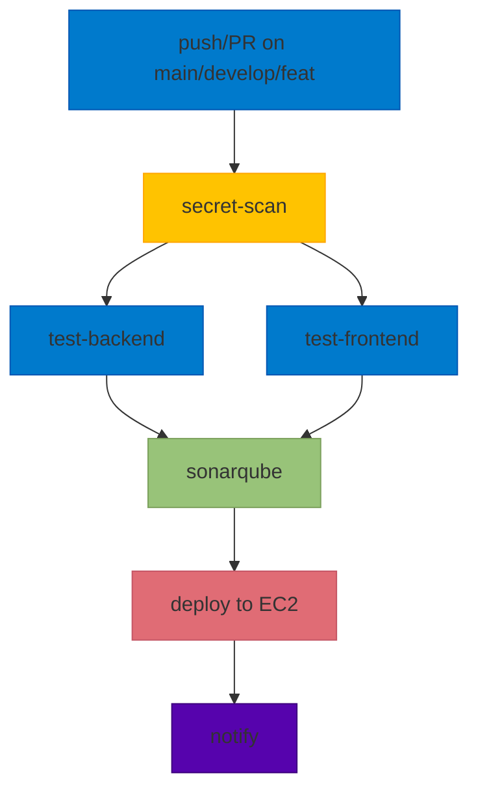
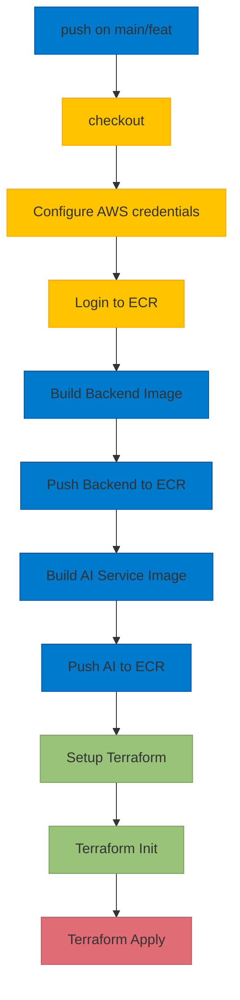
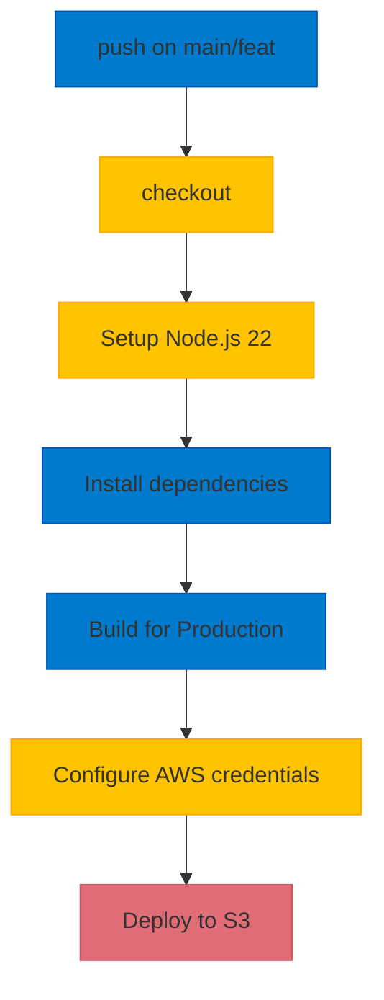

# 🏗️ Glycopilot - Infrastructure & CI/CD Architecture

> **Documentation complète de l'architecture infrastructure et des pipelines CI/CD**
> *Généré automatiquement - Dernière mise à jour: $(date +%Y-%m-%d)*

---

## 📌 Table des matières

1. [🏗️ Architecture d'Infrastructure](#-architecture-dinfrastructure)
   - [Vue d'ensemble AWS Plan B](#vue-densemble-aws-plan-b)
   - [Architecture Locale (Docker Compose)](#architecture-locale-docker-compose)
2. [⚙️ Pipelines CI/CD](#-pipelines-cicd)
   - [Workflow 1: ci.yml (Deploy to AWS EC2)](#workflow-1-ciyml-deploy-to-aws-ec2)
   - [Workflow 2: plan-b.yml (Deploy Enterprise - AWS ECS + Terraform)](#workflow-2-plan-byml-deploy-enterprise---aws-ecs--terraform)
   - [Workflow 3: frontend_web.yml (Deploy Frontend Web to S3)](#workflow-3-frontend_webyaml-deploy-frontend-web-to-s3)
   - [Flux de déploiement complet](#flux-de-déploiement-complet)
3. [📋 Récapitulatif des Composants](#-récapitulatif-des-composants)
4. [🎯 Points Clés](#-points-clés)
5. [🔗 URLs Importantes (AWS Plan B)](#-urls-importantes-aws-plan-b)
6. [📌 Améliorations Possibles](#-améliorations-possibles)

---

## 🏗️ Architecture d'Infrastructure

### Vue d'ensemble AWS Plan B

```
┌─────────────────────────────────────────────────────────────────────────────────────────────────────────────────────────┐
│                                                                     CLIENT                                      │
└─────────────────────────────────────────────────────────────────────────────────────────────────────────────────────────┘
                                           │
                                           ▼
┌─────────────────────────────────────────────────────────────────────────────────────────────────────────────────────────┐
│                                                                     AWS PLAN B                                   │
│  ┌─────────────────────────────────────────────────────────────────────────────────────────────────────────────────────┐  │
│  │                                        VPC (10.1.0.0/16)                                                       │  │
│  │  ┌─────────────────────────┐    ┌─────────────────────────┐    ┌─────────────────────────────────────────────┐  │  │
│  │  │   SUBNET PUBLIC 1        │    │   SUBNET PUBLIC 2        │    │        SUBNETS PRIVÉS (DB/Redis)            │  │  │
│  │  │   10.1.1.0/24            │    │   10.1.2.0/24            │    │   10.1.10.0/24 | 10.1.11.0/24               │  │  │
│  │  │   AZ: eu-west-3a         │    │   AZ: eu-west-3b         │    │   (Multi-AZ pour HA)                         │  │  │
│  │  └──────────┬────────────────┘    └──────────┬────────────────┘    └──────────────────┬───────────────────────┘  │  │
│  │             │                              │                              │                          │  │
│  │             ▼                              ▼                              ▼                          │  │
│  │  ┌─────────────────────────────────────────────────────────────────────────────────────────────────────────────┐    │  │
│  │  │                             🌐 INTERNET GATEWAY (IGW)                                         │    │  │
│  │  └─────────────────────────────────────────────────────────────────────────────────────────────────────────────┘    │  │
│  │             │                              │                                                  │  │
│  │             ▼                              ▼                                                  │  │
│  │  ┌─────────────────┐          ┌─────────────────┐                                  ┌─────────────────┐  │  │
│  │  │   ALB (HTTP)     │          │   ALB (HTTP)     │                                  │   NAT GATEWAY   │  │  │
│  │  │   (glycopilot-alb)│          │   (glycopilot-alb)│                                  │   (pour DB/Redis)│  │  │
│  │  └──────────┬───────┘          └──────────┬───────┘                                  └──────────┬─────┘  │  │
│  │             │                             │                                             │            │  │
│  │             ▼                             ▼                                             ▼            │  │
│  │  ┌─────────────────────────────────────────────────────────────────────────────────────────────────────────────┐    │  │
│  │  │                         🎯 LOAD BALANCER (Application LB)                                       │    │  │
│  │  │  - DNS: glycopilot-alb-1175156610.eu-west-3.elb.amazonaws.com                                   │    │  │
│  │  │  - Ports: 80 (HTTP) → Target Group (port 8000)                                               │    │  │
│  │  └─────────────────────────────────────────────────────────────────────────────────────────────────────────────┘    │  │
│  │                                                                                                    │    │  │
│  │  ┌─────────────────────────────────────────────────────────────────────────────────────────────────────────────┐    │  │
│  │  │                         🐳 ECS FARGATE (1 tâche)                                                │    │  │
│  │  │  ┌─────────────────────────────────────────────────────────────────────────────────────────────────────┐    │    │  │
│  │  │  │  📦 CONTAINER 1: Backend (Django + Daphne)                                                │    │    │  │
│  │  │  │     - Port: 8000                                                                         │    │    │  │
│  │  │  │     - Image: ECR/glycopilot-backend:latest                                              │    │    │  │
│  │  │  │     - Env: DB_HOST, REDIS_HOST, AI_SERVICE_URL=http://127.0.0.1:8001                      │    │    │  │
│  │  │  │     - Command: collectstatic → migrate → daphne -b 0.0.0.0 -p 8000                         │    │    │  │
│  │  │  └─────────────────────────────────────────────────────────────────────────────────────────────────────┘    │    │  │
│  │  │  ┌─────────────────────────────────────────────────────────────────────────────────────────────────────┐    │    │  │
│  │  │  │  🤖 CONTAINER 2: AI Service (FastAPI)                                                   │    │    │  │
│  │  │  │     - Port: 8001                                                                         │    │    │  │
│  │  │  │     - Image: ECR/glycopilot-ai-service:latest                                           │    │    │  │
│  │  │  │     - Env: django_url=http://127.0.0.1:8000, internal_token                               │    │    │  │
│  │  │  └─────────────────────────────────────────────────────────────────────────────────────────────────────┘    │    │  │
│  │  │  - Security Group: glycopilot-ecs-sg-plan-b (ingress:8000 depuis ALB)                        │    │    │  │
│  │  │  - Logs: CloudWatch (/ecs/glycopilot-plan-b)                                               │    │    │  │
│  │  └─────────────────────────────────────────────────────────────────────────────────────────────────────────────┘    │  │
│  │                                                                                                    │    │  │
│  │  ┌─────────────────────────┐    ┌─────────────────────────┐                                         │    │  │
│  │  │   🗃️  RDS POSTGRESQL   │    │   🔴 ELASTICACHE REDIS   │                                         │    │  │
│  │  │   - Instance: db.t3.micro │    │   - Instance: cache.t3.micro                              │    │    │  │
│  │  │   - Engine: PostgreSQL 16  │    │   - Engine: Redis 7.1                                    │    │    │  │
│  │  │   - Storage: 20Go         │    │   - Nodes: 1                                             │    │    │  │
│  │  │   - DB: glycopilot_prod_db│    │   - Port: 6379                                           │    │    │  │
│  │  │   - User: glycopilot_admin│    │   - SG: glycopilot-redis-sg-plan-b                        │    │    │  │
│  │  │   - SG: glycopilot-rds-sg  │    │                                                          │    │    │  │
│  │  └─────────────────────────┘    └─────────────────────────┘                                         │    │  │
│  │                                                                                                    │    │  │
│  │  ┌─────────────────────────┐                                                                             │    │  │
│  │  │   📁 S3 BUCKET           │                                                                             │    │  │
│  │  │   - Name: glycopilot-web-frontend-${ACCOUNT_ID}                                             │    │    │  │
│  │  │   - Static Website Hosting                                                                 │    │    │  │
│  │  │   - Public Access: ✅ (GetObject)                                                           │    │    │  │
│  │  │   - URL: http://${bucket}.s3-website-eu-west-3.amazonaws.com                                │    │    │  │
│  │  └─────────────────────────┘                                                                             │    │  │
│  │                                                                                                    │    │  │
│  │  ┌─────────────────────────┐                                                                             │    │  │
│  │  │   🐳 ECR REPOSITORIES    │                                                                             │    │  │
│  │  │   - glycopilot-backend:latest                                                               │    │    │  │
│  │  │   - glycopilot-ai-service:latest                                                            │    │    │  │
│  │  └─────────────────────────┘                                                                             │    │  │
│  └─────────────────────────────────────────────────────────────────────────────────────────────────────────────────┘  │
│                                                                                                                    │
│  ┌─────────────────────────────────────────────────────────────────────────────────────────────────────────────────────┐  │
│  │                                        IAM ROLES                                                             │  │
│  │  - ecs-execution-role: AmazonECSTaskExecutionRolePolicy (pull ECR, write logs)               │  │
│  │  - ecs-task-role: Custom role (accès S3 pour Django)                                         │  │
│  └─────────────────────────────────────────────────────────────────────────────────────────────────────────────────────┘  │
└─────────────────────────────────────────────────────────────────────────────────────────────────────────────────────────┘
```

### Architecture Locale (Docker Compose)

```
┌─────────────────────────────────────────────────────────────────────────────────────────────────────────────────────────┐
│                                 LOCAL DEVELOPMENT (docker-compose.yml)                                            │
└─────────────────────────────────────────────────────────────────────────────────────────────────────────────────────────┘

  PROFILE: "local"                                   PROFILE: "aws" (simulation)
  ─────────────────                                 ─────────────────
       │                                                │
       ▼                                                ▼

  ┌─────────────────┐          ┌─────────────────┐
  │   MySQL 8.0     │          │  PostgreSQL 16   │
  │   (3306)        │          │  (5432)         │
  └────────┬────────┘          └────────┬────────┘
           │                           │
           ▼                           ▼
  ┌─────────────────┐          ┌─────────────────┐
  │    Redis 7      │          │    Redis 7      │
  │    (6379)       │          │    (6379)       │
  └────────┬────────┘          └────────┬────────┘
           │                           │
           ▼                           ▼
  ┌─────────────────┐          ┌─────────────────┐
  │   Backend       │          │   Backend       │
  │   Django        │          │   Django        │
  │   (8006→8000)   │◄─────────►│   (8000)        │
  │   + Scheduler   │    API    │   + Scheduler   │
  └────────┬────────┘          └────────┬────────┘
           │                           │
           ▼                           ▼
  ┌─────────────────┐          ┌─────────────────┐
  │   AI Service    │          │   AI Service    │
  │   FastAPI       │          │   FastAPI       │
  │   (8001)        │          │   (8001)        │
  └────────┬────────┘          └────────┬────────┘
           │                           │
    ┌──────▼──────┐            ┌──────▼──────┐
    │ Frontend    │            │ Frontend    │
    │ React Native│            │ Web (React)│
    │ (8081)      │            │ (3000)     │
    └─────────────┘            └────────┬────────┘
                                            │
                                            ▼
                                    ┌─────────────────┐
                                    │    Nginx        │
                                    │   (80/443)      │
                                    └─────────────────┘
```

---

## ⚙️ Pipelines CI/CD

### Workflow 1: ci.yml (Deploy to AWS EC2)



**Étapes détaillées:**

1. **secret-scan**
   - Outil: Gitleaks v8.29.0
   - Scan complet du repository
   - Génération d'un rapport JSON

2. **test-backend**
   - Environnement: Python 3.11
   - Tests: pytest avec coverage
   - Lint: flake8 (E9, F63, F7, F82)
   - Artefacts: coverage.xml

3. **test-frontend**
   - Environnement: Node.js 22
   - Tests: npm test -- --coverage --watchAll=false
   - Artefacts: coverage/lcov.info

4. **sonarqube**
   - Analyse statique complète
   - Quality Gate vérification
   - Métriques: bugs, vulnérabilités, code smells, coverage
   - Rapport automatique sur les PRs

5. **deploy** (seulement sur main/feat/deploy-complete-b)
   - Transfert SCP vers EC2
   - Déploiement: `docker compose --profile aws up -d`
   - Création des fichiers .env.prod depuis les secrets

6. **notify** (toujours exécuté)
   - Résumé du pipeline
   - Status de chaque job

---

### Workflow 2: plan-b.yml (Deploy Enterprise - AWS ECS + Terraform)



**Détails:**
- **Images ECR:**
  - Backend: `${ACCOUNT_ID}.dkr.ecr.eu-west-3.amazonaws.com/glycopilot-backend:latest`
  - AI Service: `${ACCOUNT_ID}.dkr.ecr.eu-west-3.amazonaws.com/glycopilot-ai-service:latest`

- **Terraform Apply:**
  ```bash
  terraform apply -auto-approve \
    -var="django_secret_key=${{ secrets.DJANGO_SECRET_KEY }}" \
    -var="db_password=${{ secrets.DB_PASSWORD }}"
  ```

---

### Workflow 3: frontend_web.yml (Deploy Frontend Web to S3)



**Détails:**
- **Build Command:** `npm run build`
- **Environment:** `VITE_API_URL=http://glycopilot-alb-1175156610.eu-west-3.elb.amazonaws.com/api`
- **Deploy Command:**
  ```bash
  aws s3 sync ./frontend_web/dist/ \
    s3://glycopilot-web-frontend-958587270787/ \
    --delete
  ```

---

### Flux de déploiement complet

```mermaid
graph LR
    Dev[Développeur] -->|push| GitHub[GitHub Repository]
    GitHub -->|trigger| CI[GitHub Actions]
    CI -->|test & build| Artefacts[Artefacts]
    Artefacts -->|deploy| AWS[AWS Production]
    
    subgraph AWS
        A[EC2] -->|Plan A| B[Docker Compose]
        C[ECS] -->|Plan B| D[Fargate]
        E[S3] -->|Frontend| F[Static Website]
    end
    
    style Dev fill:#007acc
    style GitHub fill:#000
    style CI fill:#98c379
    style Artefacts fill:#ffc300
    style AWS fill:#e06c75
```



---

## 📋 Récapitulatif des Composants

### Tableau des Services

| **Type** | **Composant** | **Technologie** | **Environnement** | **Port/URL** |
|----------|--------------|----------------|------------------|--------------|
| **Backend** | API Django | Python + Daphne | Local: Docker, AWS: ECS | Local: 8006→8000, AWS: 8000 |
| **AI** | Service FastAPI | Python | Local: Docker, AWS: ECS | 8001 |
| **Frontend Web** | React | Node.js | Local: Docker, AWS: S3 | Local: 3000, AWS: S3 Website |
| **Frontend Mobile** | React Native | Node.js | Local: Docker | 8081 |
| **Base de données** | PostgreSQL | RDS | AWS: Plan B | 5432 |
| **Base de données** | MySQL | Docker | Local | 3306 |
| **Cache** | Redis | ElastiCache | AWS: Plan B | 6379 |
| **Cache** | Redis | Docker | Local | 6379 |
| **Reverse Proxy** | Nginx | Docker | Local (AWS profile) | 80/443 |
| **Load Balancer** | ALB | AWS | Plan B | 80→8000 |
| **Orchestration** | ECS Fargate | AWS | Plan B | - |
| **Images** | ECR | AWS | Plan B | - |
| **Stockage** | S3 | AWS | Plan B | - |
| **CI/CD** | GitHub Actions | GitHub | Cloud | - |

### Configuration AWS Plan B

| **Service AWS** | **Ressource** | **Configuration** | **Coût** |
|----------------|--------------|------------------|---------|
| VPC | glycopilot_vpc_plan_b | CIDR: 10.1.0.0/16 | Gratuit |
| Subnets | Public (x2) | 10.1.1.0/24, 10.1.2.0/24 | Gratuit |
| Subnets | Privé (x2) | 10.1.10.0/24, 10.1.11.0/24 | Gratuit |
| Internet Gateway | glycopilot_igw_plan_b | - | Gratuit |
| NAT Gateway | - | Pour DB/Redis | ~$0.045/h |
| ALB | glycopilot-alb | Application LB | ~$16/mois |
| ECS | glycopilot-cluster | Fargate | ~$10/mois (1 vCPU, 2GB) |
| RDS | glycopilot-db-plan-b | db.t3.micro, 20GB | ~$15/mois |
| ElastiCache | glycopilot-redis | cache.t3.micro | ~$15/mois |
| S3 | glycopilot-web-frontend | Static Website | ~$1/mois |
| ECR | glycopilot-backend | - | ~$0.10/GB |
| ECR | glycopilot-ai-service | - | ~$0.10/GB |
| CloudWatch | /ecs/glycopilot-plan-b | 7 jours retention | Gratuit |

---

## 🎯 Points Clés

### Infrastructure AWS (Plan B)

✅ **Scalable** : ECS Fargate permet de scaler horizontalement
✅ **Sécurisé** : VPC isolé, Security Groups restrictifs, IAM roles minimaux
✅ **Économique** : Instances t3.micro, 1 Redis node, 20Go RDS storage
✅ **HA-Ready** : Multi-AZ possible (désactivé pour coûts), ALB multi-subnets
✅ **Observabilité** : CloudWatch Logs pour ECS, Health Checks sur ALB

### CI/CD

✅ **Sécurité** : Secret scanning (gitleaks) avant tout déploiement
✅ **Qualité** : Tests backend (pytest + coverage) + frontend (jest)
✅ **Analyse** : SonarCloud avec Quality Gate et rapport automatique
✅ **Automatisé** : Déploiement déclenché sur push (main/feat branches)
✅ **Flexible** : 2 stratégies de déploiement (EC2 + Plan B AWS)

### Architecture Microservices

✅ **Découplage** : Backend ≠ AI Service (communication HTTP interne)
✅ **Résilience** : Redis pour cache, Health Checks sur tous les services
✅ **Modularité** : Conteneurs indépendants (backend, ai, frontend)

---

## 🔗 URLs Importantes (AWS Plan B)

| **Service** | **URL** | **Description** |
|------------|---------|----------------|
| ALB | `http://glycopilot-alb-1175156610.eu-west-3.elb.amazonaws.com` | Application Load Balancer |
| Frontend Web | `http://glycopilot-web-frontend-${ACCOUNT_ID}.s3-website-eu-west-3.amazonaws.com` | Site statique S3 |
| ECR Backend | `${ACCOUNT_ID}.dkr.ecr.eu-west-3.amazonaws.com/glycopilot-backend:latest` | Image Docker Backend |
| ECR AI | `${ACCOUNT_ID}.dkr.ecr.eu-west-3.amazonaws.com/glycopilot-ai-service:latest` | Image Docker AI |
| RDS Endpoint | `glycopilot-db-plan-b.${RDS_ID}.eu-west-3.rds.amazonaws.com:5432` | Base de données PostgreSQL |
| Redis Endpoint | `glycopilot-redis.${CACHE_ID}.ngz.${AZ}.cache.amazonaws.com:6379` | Cache Redis |
| SonarCloud | `https://sonarcloud.io/summary/overall?id=Glycopilot_Glycopilot` | Analyse de code |

---

## 📌 Améliorations Possibles

| **Catégorie** | **Amélioration** | **Impact** | **Complexité** |
|--------------|------------------|------------|---------------|
| **Sécurité** | Activer Multi-AZ pour RDS | ⬆️ HA, ⬇️ Coût | Moyenne |
| **Sécurité** | HTTPS sur ALB (certificat ACM) | ⬆️ Sécurité | Facile |
| **Performance** | CloudFront devant S3 | ⬆️ Cache, ⬇️ Latence | Moyenne |
| **CI/CD** | Ajouter staging environment | ⬆️ Qualité, ⬆️ Complexité | Élevée |
| **Observabilité** | CloudWatch Alarms + SNS | ⬆️ Monitoring | Facile |
| **Coût** | Spot Instances pour ECS | ⬇️ Coût, ⬇️ Stabilité | Moyenne |
| **CI/CD** | Intégrer tests de charge | ⬆️ Qualité | Moyenne |
| **Sécurité** | WAF devant ALB | ⬆️ Protection DDoS | Moyenne |
| **Backup** | Activer backups RDS (35 jours) | ⬆️ Résilience | Facile |
| **Monitoring** | Prometheus + Grafana | ⬆️ Observabilité | Élevée |

---

## 📚 Références

- **Code Source:** [Glycopilot Repository](https://github.com/organization/glycopilot)
- **Terraform Plan B:** [`./infra/terraform-plan-b/`](./infra/terraform-plan-b/)
- **Docker Compose:** [`docker-compose.yml`](docker-compose.yml)
- **GitHub Workflows:** [`./.github/workflows/`](.github/workflows/)
- **Documentation AWS:** [AWS Documentation](https://docs.aws.amazon.com/)
- **SonarCloud:** [SonarCloud Docs](https://docs.sonarcloud.io/)

---

## 📝 Historique des modifications

| **Date** | **Auteur** | **Modification** | **Version** |
|----------|------------|-----------------|-------------|
| $(date +%Y-%m-%d) | Mistral Vibe | Création initiale | 1.0 |

---

*Document généré automatiquement. Pour les mises à jour, modifier les fichiers source et régénérer.*
